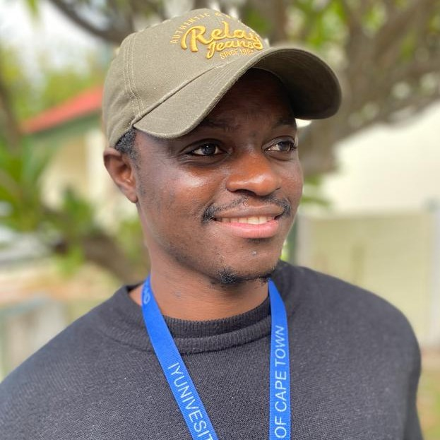

## About esohinformatics
* * *
Learning bioinformatics can be challenging, especially in Africa where resources
are limited, including expert supervision/mentorship. In addition, many students 
tend to have numerous distracting commitments due in part to limited funding for
their studies. Some of those who are fortunate to get funding face highly unstructured
curricula or curricula that include little to nothing in Bioinformatics, and are 
thus left to learn the core *Bioiformatics* on their own.

Simply put, I learned Bioinformatics the very hard way. Luckily, I had Google and 
YouTube to help me. But more importantly, I learned because I had a problem to solve, 
my MSc project (described below). I believe ***patience***, ***persistence***, and 
***resilience***, in addtion to [passion](){:em} and ***curiosity*** are key to learning 
Bioinformatics (as are key to learning anything). I can say I have picked up a few 
tricks that should be useful to new learners as well as to other Bioinformaticians.

**esohinformatics** is a platform to share some the tricks I picked from my approach 
to learning Bioinformatics, as well as to share my solutions to some of the problems 
I have encountered doing Bioinformatics or problems that colleagues have 
shared with me and that do not have comprehensive solutions in the public domain.
I will share these in the form of tutorials and short posts. I will also share 
workflows that I have developed for various projects.

I will also share some command-line tricks that can really make your Bioinformatics 
life easy.

## What I do/can do
* * *
### Core areas
I work with data in these areas routinely/regularly.
- Genetic association studies (genome-wide and candidate gene or targeted genotyping).
- NGS analysis (whole-genome, whole-exome) for monogenic and complex diseases.
- Population genetics (human and *Plasmodium falciparum*, mutation age analysis).

### On needs basis
I have worked with data in these areas extensively previously, but currently do 
so only on special requests. I have developed pipelines/workflows for colleagues in most 
of the areas. 
- Pharmacogenomics.
- Protein structure prediction and mutation analysis.
- Molecular dynamic simulation.
- Immune simulation for vaccine peptides/proteins.

## About me
* * *

Kevin Esoh from Cameroon.

I am a PhD candidate in Human Genetics in the Division of Human Genetics at the
University of Cape Town, South Africa. I work part-time as a Bioinformatician
for the [GeneMAP](https://twitter.com/GeneMAPOfficial){:target="_blank" title="Genetic Medicine of African Populations"}
research group.

I did my MSc studies in Bioinformatics and molecular biology in Kenya funded
by [DELGEME](https://www.delgeme.org/){:target="_blank" title="Developing Excellence in Leadership and Genetics Training for Malaria Elimination in Africa"}. 
My [project](http://ir.jkuat.ac.ke/handle/123456789/5663){:target="_blank"}
was based on malaria genomics in Cameroon where I first characterized the 
[genetic structure of some Cameroonian malaria-endemic populations](https://www.nature.com/articles/s41598-020-79124-1){:target="_blank"}, 
and then I screened the genomes of the populations for markers of malaria 
susceptibility markers. The genetic strutcure study was published in 
*Scientific Reports*. The genome-wide assoction study (GWAS) uncovered 
two novel malaria protective genes and it is currently under review.

Before moving to Kenya, I did my undergrad studies in Cameroon at the University 
of Buea (UB) from 2012-2015. I majored in Biochemistry and minored in Medical Laboratory 
Technology graduating with first class honors (I couldn't have picked a better field). 

After my BSc program, I enrolled for an MSc in Biochemistry in UB from 2016-2017,
completed coursework and started a project before getting the scholarship to 
study in Kenya.

The project was bioinformatics-oriented as I had become particulary interested, 
in the field. The project was titled [Reverse vaccinology for Onchocerciasis vaccine development](https://drive.google.com/file/d/0B0rTlaNV5kvnTy0zY1RRY0Nld2c/view?resourcekey=0-gsC4CrSNEk4oVr96rVvvUw){:target="_blank"}. I screened the entire proteome 
of *O. volvulus* (over 12,000 proteins) for antigenic or immunogenic proteins
with the goal of finding potential vaccine candidates. The project was continued
by my senior who was doing his PhD in Belgium on diagnostic strategies. I workied 
with him closely and we eventually published one of the first comprehensive
[papers](https://www.nature.com/articles/s41598-019-40833-x){:target="_blank"} on reverse
vaccinology based on multiple predicted epitopes from different antigenic proteins.

## Summary
* * *
- **2020 - present**: Human Genetics PhD candidate, University of Cape Town, South Africa.
- **2017 - 2019**: MSc in Bioinformatics and Molecular Biology, JKUAT, Kenya.
- **2016 - 2017**: MSc in Biochemistry, University of Buea, Cameroon.
- **2012 - 2015**: BSc in Biochemistry, University of Buea, Cameroon.

## More info
* * *
Learn more about me and my education from my Q&A with the [Kenya Education Network](https://www.kenet.or.ke/blog/admin/qa-using-big-data-malaria-elimination-africa){:target="_blank"}

